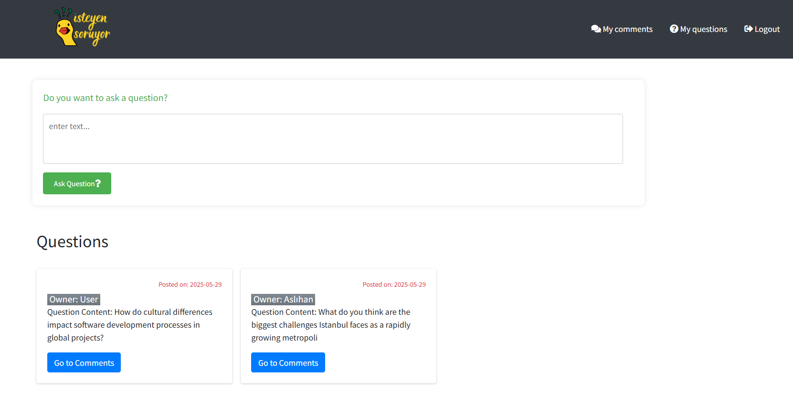
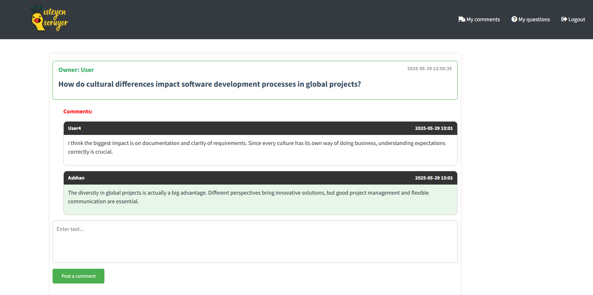
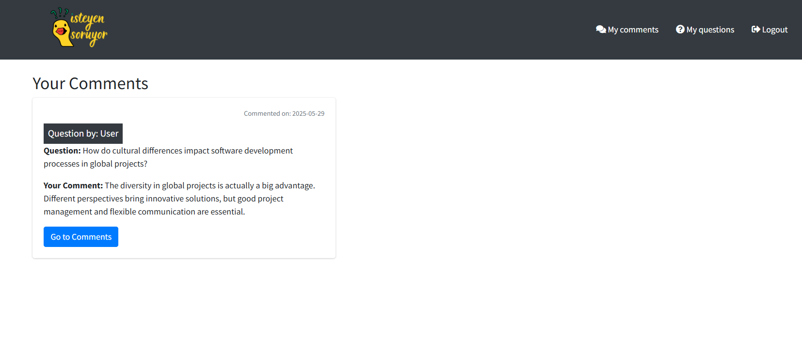
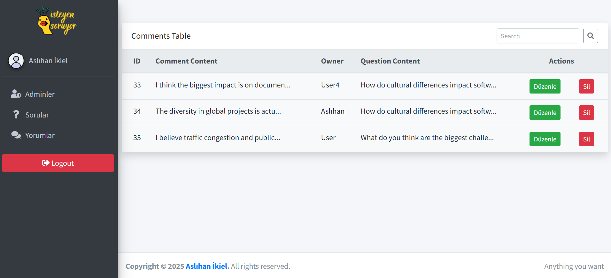

# İsteyen Soruyor Projesi

Bu proje, Laravel framework'ü kullanılarak geliştirilmiş bir soru-cevap platformudur. Kullanıcılar soru sorabilir, yorum yapabilir ve yönetici paneli üzerinden içerikler yönetilebilir.

## Proje Yapısı

- **app/**: Ana uygulama kodları
  - **Http/Controllers/**: Controller sınıfları
    - **User/**: Kullanıcı işlemleri (kayıt, giriş, soru ve yorum yönetimi)
    - **Admin/**: Yönetici işlemleri (soru, yorum ve admin yönetimi)
- **routes/**: Rota tanımlamaları
  - **web.php**: Web rotaları
  - **admin.php**: Admin rotaları
  - **api.php**: API rotaları
- **resources/views/**: Blade şablonları
  - **user/**: Kullanıcı arayüzü
  - **admin/**: Yönetici arayüzü

## Kullanıcı İşlevleri

- Kayıt olma ve giriş yapma
- Soru sorma ve görüntüleme
- Yorum yapma
- Cevaplanmış ve kendi sorularını görüntüleme

## Yönetici İşlevleri

- Yönetici girişi
- Soru yönetimi (listeleme, düzenleme, silme)
- Yorum yönetimi (listeleme, düzenleme, silme)
- Admin kullanıcı yönetimi (listeleme, düzenleme, silme)

## Ekran Görüntüleri

- 
- 
- 
- 

## Kurulum

1. Projeyi klonlayın.
2. Bağımlılıkları yükleyin:
   ```bash
   composer install
   npm install
   ```
3. `.env` dosyasını oluşturun ve gerekli ayarları yapın.
4. Veritabanı migrationlarını çalıştırın:
   ```bash
   php artisan migrate
   ```
5. Uygulamayı başlatın:
   ```bash
   php artisan serve
   ```

## Lisans

Bu proje MIT lisansı altında lisanslanmıştır.
